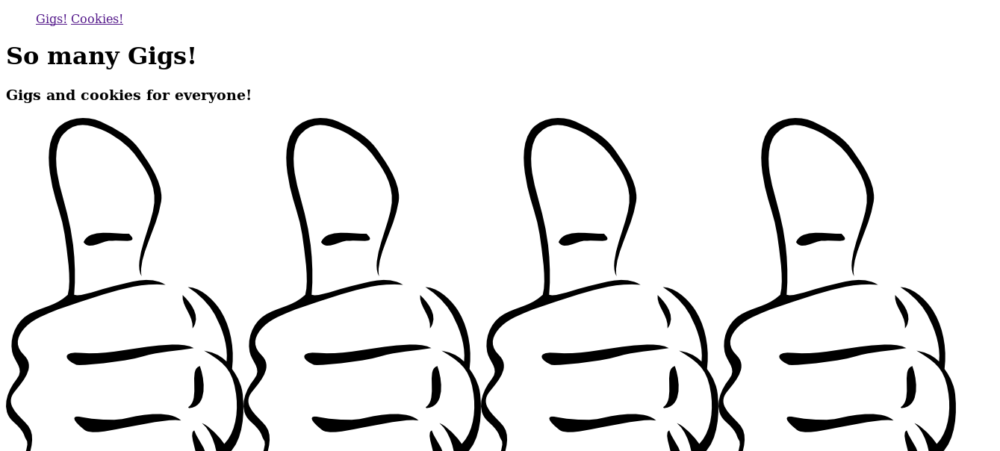
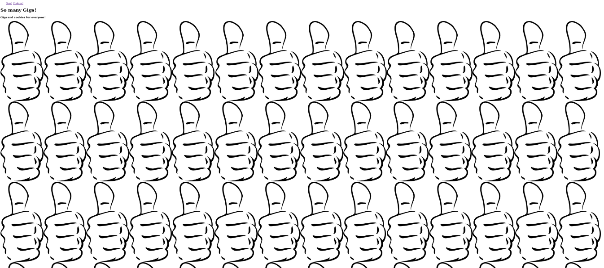
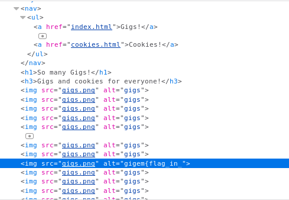
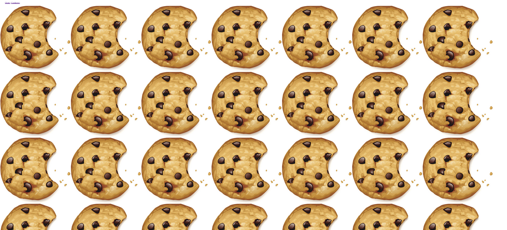
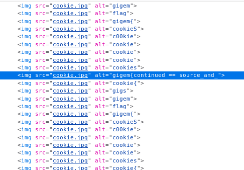
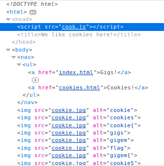
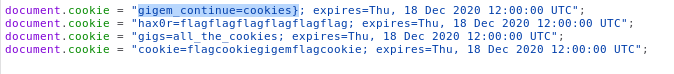

# Robots Rule(<http://web7.tamuctf.com/>)

## [**Fr**]

### Difficulté: Facile

La page index du challenge se présente comme suit:

Si on dezoom un peu:

La page n'affiche que des pouces. Regardons un peu du coté du code source

Dans l'une des balises img, il y'a un text dans l'attribut alt qui semble être une un partie du flag `gigem{flag_in_}`. Explorons la seconde page, à savoir la page cookies.html.

Comme la page d'index nous avons plusieurs images qui se repetent. Explorons donc le code source:

Nous avons une nouvelle ligne qui nous interpelle: `gigem{continued==source_and_}`

c'est un peu comme si la suite de flag est égale à "source_and_"
donc nous avons `gigem{flag_in_source_and_}`

hmmmm and what???

En inspectant un peu mieux la page on se rend compte qu'un fichier JS est chargé en début de page.

Regardons le contenu du fichier cook.js

Le cookie `gigem_continue` semble être la suite de notre flag. Pour finir nous avons donc:

`gigem{flag_in_source_and_cookies}`