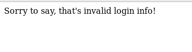

# Not Another SQLi Challenge (<http://web1.tamuctf.com/>)

## [**Fr**]

### Difficulté: Facile

Alors le nom du challenge nous donne d'entrée de jeux à quel type de vulnérabilité on a affaire.
Une fois qu'on accède au challenge, nous avons cette page:

Nous avons deux champs "NetID" et "Password".
Pour tester si ces champs sont vulnérables aux injections SQL nous allons tenter de générer une erreur dans l'écriture de la requête en saisissant une quote (') dans l'un des champs pour identifier le champ vulnérable.
Mais avant testons le formulaire avec des saisies normales pour voir le résultat:

Et lorsque nous saisissons une quote dans l'un des champs:

Nous avons une page blanche comme retour. Les deux champs semble être vulnérable car elles nous ramènent des pages blanches. Essayons alors un payload très simple pour les injections SQL.

`' or 1=1 #'`

Bingo nous avons le flag

