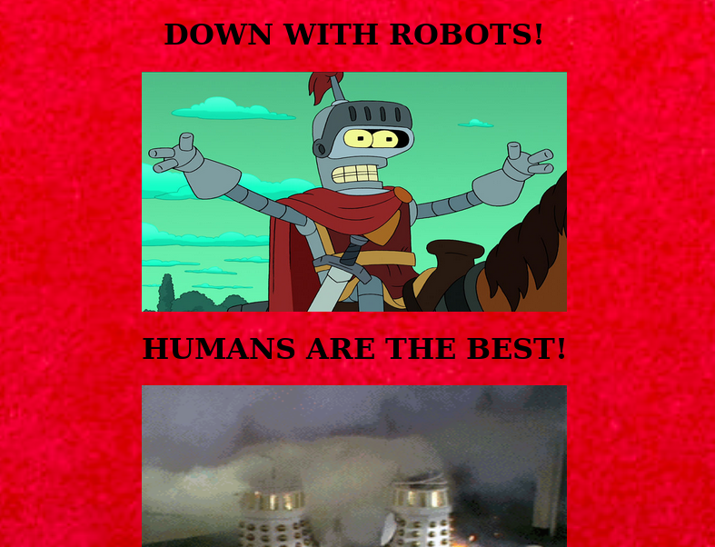
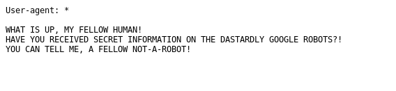
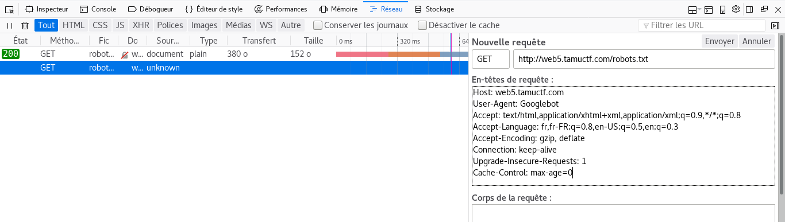
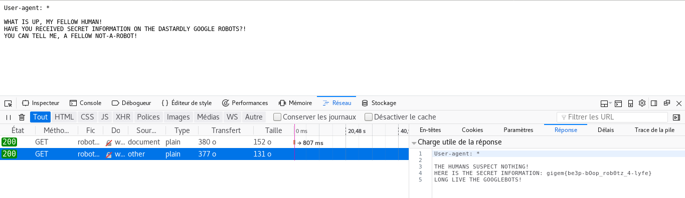

# Robots Rule(<http://web5.tamuctf.com/>)

## [**Fr**]

### Difficulté: Facile

La page index du challenge se présente comme suit:

Il semblerait que ce site n'aime pas trop les robots... essayons de voir s'il n'y a pas de fichier robots.txt sur le site. robots.txt est le protocole d'exclusion des robots. Par convention lorsqu'un robot essaie d'indexer un site web, il commence par le fichier robots.txt, qui se trouve à la racine du site, avant d'explorer le reste du site et savoir qu'est ce qui lui est permis ou pas.
Plus d'info [ici](http://robots-txt.com/).
Donc en saisissant l'URL <http://web5.tamuctf.com/robots.txt> nous avons la page suivante

Apparement les robots de google savent des choses que nous ne savont pas. Nous allons essayer de modifier notre `user-agent` et utiliser celui des robots de google.

On ouvre simplement notre console et on modifie une requête HTTP et spécifiant le `user-agent` "Googlebot"

We got it
